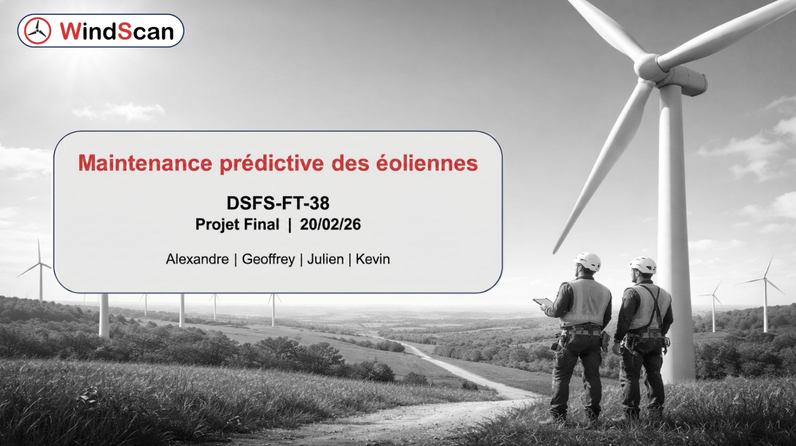

# WindScan - Maintenance prédictive d'éoliennes

Projet final réalisé dans le cadre du bloc 6 de la certification CDSD (Jedha).

---

## Contexte

Une société d'exploitation d'éoliennes veut anticiper les besoins de maintenance avant que les pannes surviennent. À partir des données de 8 capteurs physiques (vitesse rotor, puissance, température boîte de vitesse, vibrations...) relevées toutes les heures sur 2 turbines, l'objectif est de prédire le type de maintenance à venir :

- **0** - Pas de maintenance requise
- **1** - Maintenance mineure
- **2** - Maintenance majeure

---

## Ce que j'ai fait

**Analyse exploratoire**

Exploration des 35 000+ observations : distribution des classes (fort déséquilibre label 0 dominant), corrélations entre capteurs, comportement des variables selon le label de maintenance. Les capteurs les plus discriminants sont `Vibration_Level_mmps`, `Generator_Bearing_Temp_C` et `Gearbox_Oil_Temp_C`.

**Nettoyage**

Suppression des colonnes peu informatives (`Turbine_ID`, `Ambient_Temp_C`, `Humidity_pct`). Travail sur la Turbine 1 uniquement. Dataset nettoyé sauvegardé dans `data/processed/` et uploadé sur S3.

**Modélisation**

Comparaison de 7 configurations avec tracking MLflow :
- Baseline (DummyClassifier)
- Régression Logistique
- Lasso (LogReg L1)
- Random Forest (plusieurs configs manuelles + GridSearch)

Métrique cible : **F1-Score macro** - toutes les classes comptent également, y compris les pannes rares.

**Pipeline ETL**

Les données capteurs sont extraites depuis S3 (`windscan`), validées (plages cohérentes, schéma complet) puis chargées dans une base **Neon DB** (PostgreSQL). Le dashboard interroge directement la base SQL pour servir les prédictions.

**Dashboard**

Interface Streamlit de monitoring en temps réel : prédiction du label de maintenance à partir des données capteurs, visualisation des tendances et alertes. Les données sont chargées depuis Neon DB avec fallback S3.

---

## Résultats

| Modèle | F1 macro Train | F1 macro Test |
|--------|---------------|---------------|
| Baseline (Dummy) | 0.30 | 0.30 |
| Régression Logistique | 0.21 | 0.21 |
| Random Forest (retenu) | 0.78 | 0.34 |

Le Random Forest est le meilleur modèle malgré un overfitting notable, dû au fort déséquilibre de classes. Des pistes d'amélioration identifiées : feature engineering temporel (lags), SMOTE pour le rééchantillonnage.

---

## Démo en ligne

| Service | URL |
|---------|-----|
| Dashboard Streamlit | https://atomik31-dashboard-windscan.hf.space |
| MLflow Tracking | https://atomik31-mlflow-cdsd.hf.space |

---

## Stack

- Python - Scikit-learn, Pandas, Plotly, Streamlit, MLflow, Boto3, psycopg2
- Stockage : AWS S3 (bucket `windscan`) → ETL → Neon DB (PostgreSQL)
- Données : 35 040 observations × 8 capteurs, 2 turbines

---

## Structure

```
Projet-final-fullstack/
├── data/
│   ├── raw/                        # Données brutes
│   └── processed/                  # Données nettoyées
├── models/
│   ├── best_model.pkl              # Modèle retenu (Random Forest)
│   ├── preprocessor.pkl            # Pipeline de preprocessing
│   └── old_models/                 # Versions précédentes
├── notebook/
│   ├── EDA.ipynb                   # Analyse exploratoire
│   ├── Train.ipynb                 # Entraînement + tracking MLflow
│   ├── Data-cleaning.ipynb         # Nettoyage détaillé
│   └── Prediction.ipynb            # Prédictions sur données test
├── streamlit/
│   ├── app.py                      # Dashboard Streamlit
│   ├── requirements.txt
│   └── Dockerfile
├── src/
│   ├── train_model.py              # Script d'entraînement production
│   ├── train_model_engineering.py  # Variante avec feature engineering
│   ├── etl_to_neon.py              # ETL S3 → Neon DB
│   ├── export_figures.py           # Script d'export des figures
│   ├── dashboard.py
│   ├── run.py
│   └── test.py
├── reports/
│   └── figures/
│       ├── 01_distribution_turbines_labels.png
│       ├── 02_labels_par_turbine.png
│       ├── 03_correlation_matrices.png
│       ├── 04_boxplots_capteurs_par_label.png
│       └── 05_kde_capteurs_critiques.png
├── Dockerfile
├── requirements.txt
└── README.md
```

---

Julien CHARLIER - [(Github : Atomik31)](https://github.com/Atomik31)
